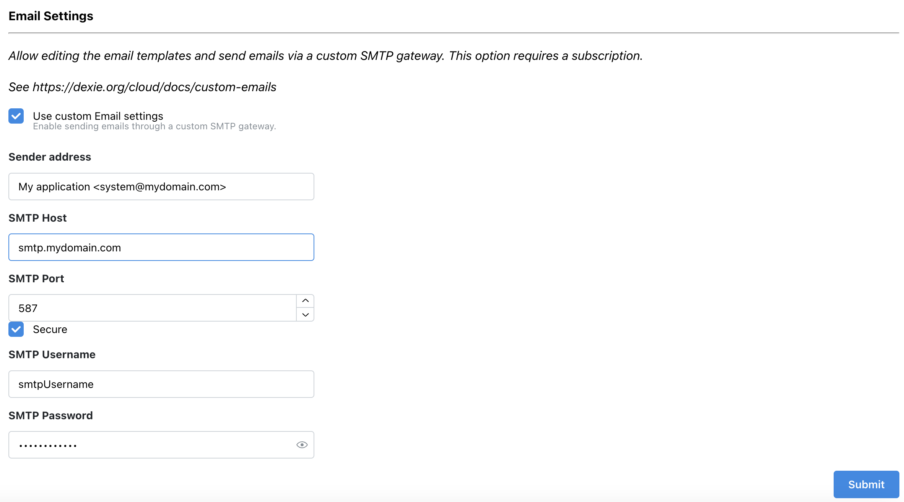

Dexie Cloud use emails to communicate with your application end users. You do not need to configure anything to get it to work, but if you prefer to let these emails be sent from a custom sender and with a custom template for the content, it is possible to configure a database with custom SMTP settings and custom email templates.

## When emails are needed

Emails are sent out in the following use cases:

- Authentication / Registration: First time a user run your application on a new device, Dexie Cloud needs to verify the identity of the user. As can be read on the docs for [authentication](authentication), you can choose to completely replace this process with your own. However, many customers prefers to stay on the built-in authentication that Dexie Cloud provides and just [customize the user interface](/cloud/docs/authentication#customizing-login-gui). The OTP messages that are sent out to the user can also be customized using the steps described later in this document.

- Invites: When a user of your app invites someone to shared data (by creating a member object connected to the realm representing the data to share), an invite may go out to the invited user. In a default setup, this email contains a simple message about the invite and the option for the user to accept or reject it. This template can also be customized using the steps described below.

## Customizing Emails

To send emails from a custom domain and a custom sender, login to [Dexie Cloud Manager](https://manager.dexie.cloud) and check the option _Use custom Email Settings_

Befor saving the changes, use the **Test button** to verify that the configured SMTP settings works and successfully sends an email. After having verified that the settings work, click the Submit button to save the changes and immediately start using this new SMTP settings whenever emails are being sent.

## Customizing Email templates

Email templates can be customized to optimize the user experience and together with [login GUI customization](/cloud/docs/authentication#customizing-login-gui), they brand your app completely.

There are two criterias that need to be fulfilled in order to customize email templates:

1. You have a purchased subscription (prod version and not just the free version). This can be purchased in [Dexie Cloud Manager](https://manager.dexie.cloud)
2. You have enabled _Use custom Email Settings_ in [Dexie Cloud Manager](https://manager.dexie.cloud) and configured it against an SMTP server.

If any of these criterias aren't met, templates can still be edited but they will not be able to push to the service.

## Editing Email Templates

The email templates can be edited using the following steps:

1. Run `npx dexie-cloud@latest templates pull` from a directory or sub-directory where your dexie-cloud.json file is located. This is normally within your app directory. _The dexie-cloud.json file is created for you when creating a new DB using `npx dexie-cloud create` or connecting to an existing db using `npx dexie-cloud connect <DB URL>`._

2. Edit the templates. They will be located under a folder called `dexie-cloud` on the same level as your `dexie-cloud.json` file. You'll find two sub directories: `web-templates/` and `email-templates/`. The latter contains handlebars templates for subject and body. Each email type have two body templates - one HTML based and one text-based (fallback for old email clients). Handlebars is an old and stable templating library described [here](https://handlebarsjs.com/guide/#what-is-handlebars)). The subject- and body-txt templates are pure texts with triple-bracket parameters (triple brackeds means no escaping). The html body template is HTML based with double-bracket variables (which makes them escaped correctly in HTML). The available variables (such as `{{otp}}`, `{{originName}}` etc) are documented within comments in each template.

3. Test templates by sending them to your own email address. Run `npx dexie-cloud templates test-send otp`. This will send a test OTP to your own email address.

   - replace the last word `otp` with `invite` so test the invite templates instead of the otp templates.
   - use `--to <someoneelse@somedomain.com>` to send the test message to other than yourself. This requires having specified custom SMTP settings on your database using Dexie Cloud Manager.
   - edit the files `otp-testdata.json` and `invite-testadata.json` to edit the template parameters used when sending a test message.

4. When done editing and testing templates, publish them by running `npx dexie-cloud templates push`. It's also a good idea to commit the files to GIT if you want them version controlled.

Steps 1-3 above can be done on the Free edition and without specifying your own SMTP settings - so that you can design and test templates right away and get everything prepared before production launch of your app. But the last step - to push templates is only possible after having purchased a subscription for you database using [Dexie Cloud Manager](https://manager.dexie.cloud). You also need to have custom SMTP settings configured in order to push your custom templates. This is also configured using [Dexie Cloud Manager](https://manager.dexie.cloud).
