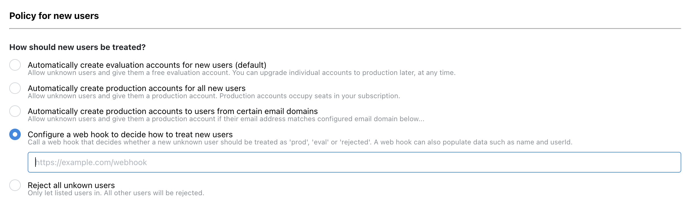

## new-user

A Dexie Cloud database can be configured to let a web hook take decision on how to treat new (unknown) users. In [Dexie Cloud Manager](https://manager.dexie.cloud), in the section **Policy for new users** (See screenshot below), it is possible to configure a URL to a web hook so that a server-side end-point can be implented to integrate the application according to custom logic or directory lookup.



### Request

When a user has been authenticated the very first time in this database, this hook will be called (if configured so in the 'Policy for new users' section of your database in [Dexie Cloud Manager](https://manager.dexie.cloud)). A POST request will then be sent to the configured URL as described below.

- HTTP Method: POST
- POST Body type:

  ```ts
  {
    "userId": string
    "email": string
  }
  ```

  Example:

  ```
  POST /webhooks/dexie-cloud HTTP/1.1
  Host: yourapp.yourdomain.com
  Content-Type: application/json
  Content-Length: 54

  {"userId":"foo@company.com","email":"bar@company.com"}
  ```

### Response

Your endpoint need to respond in the following way:

- Status Code: 200
- Content-Type: application/json
- Reponse Body Type:

  ```ts
  {
    "ok": boolean
    "action": 'reject' | 'eval' | 'prod'
    "userData"?: {
      "displayName"?: string
      "email"?: string
      [customProp: string]: any
    }
  }
  ```

  Example:

  ```
  HTTP/1.1 200 Ok
  Content-Type: application/json
  Content-Length: 27

  {"ok":true,"action":"prod"}
  ```

If providing the optional "userData" property, it will be set as "data" property on the user (See [users endpoint](rest-api#users-endpoint)). The data property is also sent down to the client and accessible via [db.cloud.currentUser](/cloud/docs/db.cloud.currentUser) observable on the client. The data property is a javascript object that can contain arbritary JSON compatible data. If data contains a property "displayName", this will be used as the user's name. If a [custom authentication](<http://localhost:4000/cloud/docs/db.cloud.configure()#example-integrate-custom-authentication>) is used, an email address might not always be known when user is authenticated but can be applied by this hook by returning a data property with the "email" property within.
